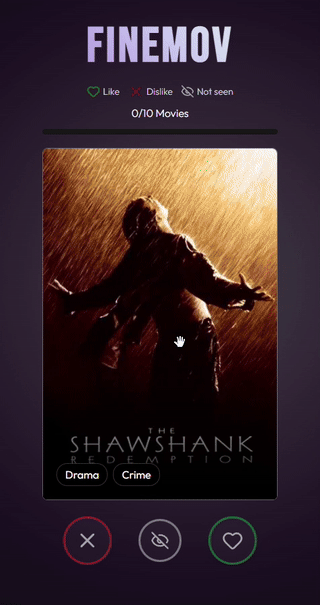

# 🎬 finemov

[](https://app.netlify.com/projects/finemov/deploys)

finemov is a React web application that helps users discover new movies.  
By liking and disliking popular movies, the app generates personalized movie recommendations based on the user’s taste.

👉 Try it here: https://finemov.netlify.app

## Demo



## 🚀 Features

- Browse popular movies from TMDB
- Like or dislike movies with a swipe-based interface
- Personalized recommendations based on user preferences
- Clickable recommendation cards to view detailed movie information

## 🛠️ Tech Stack

- React (Vite)
- JavaScript
- Tailwind CSS
- TMDB API
- Netlify Functions


## 📦 Installation & Local Development

Run the project locally with `netlify dev`.

```bash
git clone <https://github.com/noelbrm/finemov.git>
cd finemov
npm install
netlify dev
```


## 🔐 Environment Variables
Create a `.env` file in the project root:
```env
API_KEY=your_tmdb_api_key
```
You can get your API key here: https://developer.themoviedb.org/docs/getting-started


## 📜 License

This project is for educational purposes.